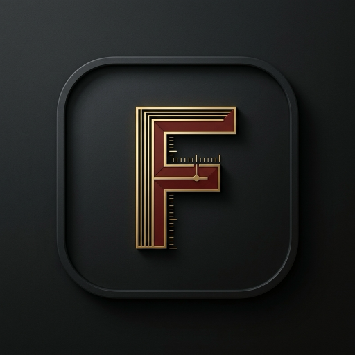

<div align="center">

<a href="https://github.com/Scrobble-dev/Fasti">
  
</a>

<br/><br/>

### *Every story, kept in time.*

**A self-hosted-first media chronicle and player for what you watch, read, hear and play.**  
Built on the open activity language developed at [Scrobble.dev](https://scrobble.dev).

<br/>

[](https://github.com/Scrobble-dev/Fasti/actions/workflows/ci.yml)
[](LICENSE)
[](https://github.com/sponsors/ryan-winkler)
[](https://opencollective.com/scrobble)
[](https://ko-fi.com/ryanw_eu)
[](https://revolut.me/ryanwi)
[](https://scrobble.dev)
[](docs/architecture/overview.md)

<br/>

[Overview](#what-is-fasti) • [The Book of Days](#the-book-of-days) • [Architecture](#architecture) • [Relationship to Scrobble.dev](#relationship-to-scrobbledev) • [Brand & Design](#brand--design-system) • [Quick Start](#quick-start) • [Roadmap](#roadmap) • [Sponsor](#supporting-fasti)

<br/>


</div>

---

## What is Fasti?

We increasingly experience culture through rented, fragmented interfaces. A film lives in one streaming catalogue, an episodic series in another, music on a subscription service, books on an e-reader, and games across multiple launchers. 

Each service remembers a fragment of your life: progress percentages, playback timestamps, ratings, and library memberships. When a service shuts down, changes its terms, or fails to export your history, that part of your cultural memory vanishes with it.

**Fasti is a personal media chronicle with playback built in.**

It records what you watch, read, hear, and play as durable, immutable events with complete provenance. It works locally and survives disconnection, synchronises seamlessly between your own devices without a central cloud, and ensures your history remains portable, correctable, and entirely under your control.

> **A scrobble records the moment. Fasti keeps the story.**

---

## The Book of Days

Historically, the Roman *fasti* were chronological registers and calendars. Ovid’s *Fasti* took that calendrical framework and wove days, observances, origins, and human experiences into narrative. 

Fasti adopts this philosophy:

```
THE EVENT          Something happened.
                   (A track played, a chapter read, an episode completed)

THE RECORD         We preserve what we know with evidence:
                   occurred_at · observed_at · received_at · source · provenance

THE STORY          Over time, those records become a meaningful personal chronicle.
```

### Core Commitments

1. **Facts Before Projections:** History is an immutable append-only event ledger. Current progress, resume positions, and library lists are derived, deterministic projections that can be rebuilt at any time.
2. **Local-First & Offline-Durable:** A node or desktop client records activity immediately into local SQLite storage. Synchronisation is a background exchange of replicas, not a blocker for playback or logging.
3. **Memory with Provenance:** Fasti never collapses different times into one timestamp. When Plex reports an episode was watched yesterday at 21:00, Fasti records when it occurred, when it was observed, and when your node received it.
4. **Correction Without Fiction:** Mistakes happen. Corrections and removals are recorded as new events that supersede older records without pretending the mistake never occurred—unless you explicitly request an irreversible privacy erasure.
5. **Durable Portability:** You can export your entire chronicle in standard, documented formats at any moment, and restore it cleanly on a fresh installation.

---

## Architecture in Sixty Seconds

Fasti is structured as a modular Rust and TypeScript monorepo designed for lightweight, high-performance execution on everything from single-board computers (Raspberry Pi) and home NAS servers to native desktop environments.

```
                   ┌──────────────────────────────────────┐
                   │             Scrobble.dev             │
                   │   profiles · schemas · conformance   │
                   └──────────────────┬───────────────────┘
                                      │ defines vocabulary
                                      ▼
┌────────────────────────────────────────────────────────────────────────┐
│                              Fasti Monorepo                            │
│                                                                        │
│   ┌─────────────────────┐   Sync Protocol    ┌─────────────────────┐   │
│   │    Fasti Desktop    │ ◄────────────────► │     Fasti Node      │   │
│   │    (Tauri Shell)    │                    │     (fastid API)    │   │
│   └──────────┬──────────┘                    └──────────┬──────────┘   │
│              │                                          │              │
│              ▼                                          ▼              │
│   ┌─────────────────────┐                    ┌─────────────────────┐   │
│   │     Fasti Core      │                    │     Fasti Core      │   │
│   │ (Domain Invariants) │                    │ (Domain Invariants) │   │
│   └──────────┬──────────┘                    └──────────┬──────────┘   │
│              │                                          │              │
│              ▼                                          ▼              │
│   ┌─────────────────────┐                    ┌─────────────────────┐   │
│   │    Local SQLite     │                    │  Event Ledger + WAL │   │
│   │    (Single Node)    │                    │   + Projections     │   │
│   └─────────────────────┘                    └─────────────────────┘   │
└────────────────────────────────────────────────────────────────────────┘
```

### Monorepo Structure

* **`apps/fastid`**: Standalone self-hosted daemon providing HTTP/REST APIs, ingestion webhooks, and sync endpoints.
* **`apps/web`**: Responsive, accessible web client built with TypeScript and modern web standards.
* **`apps/desktop`**: Native desktop application built on Tauri v2 with embedded playback support.
* **`crates/fasti-core`**: Core domain logic, UUIDv7 generation, timestamp semantics, and actor/device primitives.
* **`crates/fasti-activity`**: Event envelope parsing, validation, idempotency calculations, and receipt generation.
* **`crates/fasti-store`**: SQLite storage engine, WAL management, transactional migrations, and backup verification.
* **`crates/fasti-projections`**: Deterministic materialised view engine (resume queues, history indexes, library states).
* **`crates/fasti-sync`**: Logical replica sync protocol, cursor management, outbox/inbox queues, and sequence gap detection.
* **`crates/fasti-player`**: Playback state machine, observation adapters, and player engine abstractions.
* **`crates/fasti-connectors`**: Source importers (Floppy, Trakt, Plex, Jellyfin, Last.fm, Letterboxd) with loss accounting.
* **`crates/fasti-cli`**: Command-line administrative utility for database management, migrations, imports, and exports.
* **`packages/tokens`**: Vendor-neutral design tokens formatted to W3C DTCG 2025.10 standards.
* **`packages/schemas`**: Canonical JSON Schema definitions for activity events and export bundles.
* **`packages/sdk`**: Strongly-typed TypeScript client SDK.
* **`packages/ui`**: Shared UI component library styled around Atkinson Hyperlegible Next and Newsreader.

---

## Relationship to Scrobble.dev

Fasti maintains a strict constitutional separation between **the standard** and **the product**:

| Project | Role | Governance & Licensing |
|---|---|---|
| **[Scrobble.dev](https://scrobble.dev)** | Defines open vocabularies, activity profiles, machine-readable schemas, and conformance fixtures. | Community Specification License 1.0 / Apache-2.0 / CC0 |
| **[Fasti](https://github.com/Scrobble-dev/Fasti)** | A self-hosted-first chronicle and player that implements Scrobble.dev specifications. | AGPL-3.0-or-later (Open Source) |

* Fasti has no privileged authority to alter Scrobble.dev specifications.
* Any third-party application, media player, or platform is free to implement Scrobble.dev specifications without using Fasti or needing a licence from Fasti.
* Fasti's compatibility is verified against Scrobble.dev's independent test fixtures.

---

## Quick Start

### Prerequisites
* Rust toolchain (1.80+ recommended)
* Node.js (20+ LTS) and `pnpm` (9+)

### Build the Workspace

```bash
# Clone the repository
git clone https://github.com/Scrobble-dev/Fasti.git
cd Fasti

# Verify Rust crates
cargo check --workspace

# Install JavaScript dependencies and build packages
pnpm install
pnpm build
```

---

## Brand & Design System

Fasti and Scrobble.dev follow the **Modern Annal / Living Marginalia** design standard: an archival editorial aesthetic combining quiet horological instrumentation with publication-grade typography.

<div align="center">
  <table border="0">
    <tr>
      <td align="center" width="50%">
        <a href="brand/logos/org-icon.svg">
          
        </a>
        <br/><strong>Scrobble-dev Organization Icon</strong>
        <br/><em>Syntax Bracket & Crosswalk Node</em>
      </td>
      <td align="center" width="50%">
        <a href="brand/logos/fasti-icon.svg">
          
        </a>
        <br/><strong>Fasti Flagship App Icon</strong>
        <br/><em>Living Chronicle & Ledger Mark</em>
      </td>
    </tr>
  </table>
</div>

* **Typography Hierarchy:**
  * **The Story (Editorial Display):** *Newsreader* (Serif)
  * **The Interface (Product UI & Navigation):** *Atkinson Hyperlegible* (Sans-serif)
  * **The Evidence (Event IDs, Hashes, Code):** *IBM Plex Mono* / *Atkinson Mono* (Monospace)
* **Core Palette (WCAG 2.2 AAA / AA):** Warm Archive (`#F2EFE6`), Paper Surface (`#FFFDF8`), Carbon Ink (`#181716`), Fasti Oxblood (`#8B2E2A`), Chronicle Blue (`#1E4FA3`), and Verdigris (`#2E6F63`).
* **Ergonomics & Accessibility:** Strict 44px minimum touch targets, WCAG 2.2 AA/AAA baseline, and ADHD/AuDHD state continuity standards.

Explore the complete system:
* 🎨 **Interactive Brand Showcase:** Open [`brand/preview.html`](brand/preview.html) in any browser (`open "brand/preview.html"`) for live theme switching, component specimens, and token inspection.
* 📖 **Design System Guide:** [`brand/DESIGN.md`](brand/DESIGN.md)
* 📐 **Vector Assets & Logos:** [`brand/logos/`](brand/logos/) (`org-icon.svg`, `fasti-icon.svg`, `fasti-lockup.svg`, `scrobble-dev-lockup.svg`)
* 📦 **W3C DTCG Tokens:** [`brand/tokens/tokens.json`](brand/tokens/tokens.json)

---

## Roadmap

* [x] **Phase 0: Foundation & Governance** — Licensing, repository architecture, DCO sign-off, design tokens, issue workflows.
* [ ] **Phase 1: Event Ledger Kernel** — Rust domain core, immutable SQLite event ledger, UUIDv7 timestamps, export/restore engine.
* [ ] **Phase 2: Fasti Node & Web** — `fastid` daemon, local authentication with Passkeys/WebAuthn, web chronicle interface.
* [ ] **Phase 3: Desktop Shell & Playback** — Tauri v2 desktop application, observation pipeline, player adapter.
* [ ] **Phase 4: Multi-Device Synchronisation** — Logical replica exchange, offline queue reconciliation, sequence gap recovery.
* [ ] **Phase 5: 1.0 Release Gate** — Independent Scrobble.dev conformance verification, third-party accessibility audit, reproducible release attestations.

See [`ROADMAP.md`](ROADMAP.md) for detailed milestone dependencies.

---

## Contributing

We welcome contributions from developers, designers, archivists, and media enthusiasts!

1. All code contributions must be signed off under the **Developer Certificate of Origin (DCO 1.1)** by including a `Signed-off-by: Name <email>` line (`git commit -s`).
2. Please read our [`CONTRIBUTING.md`](CONTRIBUTING.md) for branch guidelines, code style, and contribution lanes.
3. Review our [`GOVERNANCE.md`](GOVERNANCE.md) to understand RFC procedures and project decision-making.
4. All participants are expected to uphold our [`CODE_OF_CONDUCT.md`](CODE_OF_CONDUCT.md).

---

## Security

Security and privacy are fundamental to personal history. Fasti is private by default, transmits no telemetry, and operates without mandatory central cloud dependencies.

To report a vulnerability, please follow the coordinated disclosure policy in [`SECURITY.md`](SECURITY.md).

---

## Supporting Fasti

Fasti is an independent, community-driven open-source project. We believe personal cultural history belongs to you—not closed corporate platforms or subscription walled gardens.

If you find Fasti valuable, consider sponsoring our development to help fund infrastructure, accessibility testing, and open vocabulary development:

* **[Sponsor via GitHub Sponsors](https://github.com/sponsors/ryan-winkler)**
* **[Donate via Open Collective](https://opencollective.com/scrobble)**
* **[Support via Ko-fi](https://ko-fi.com/ryanw_eu)**
* **[Direct Contribution via Revolut](https://revolut.me/ryanwi)**

---

## Licence

Fasti is open-source software licensed under the **[GNU Affero General Public License v3.0 or later (AGPL-3.0-or-later)](LICENSE)**.

Scrobble.dev specification assets and schemas are published under the Community Specification License 1.0 and Apache-2.0.
