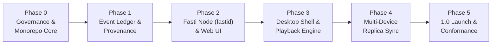

# Fasti Project Roadmap

This roadmap outlines the dependency-based sequence of milestones for Fasti. We optimize for data integrity, provenance, and verifiable portability over premature feature breadth.

---

---

## Milestone Breakdown

### Phase 0: Foundation & Workspace Scaffolding (Active)
* [x] Enshrine open-source licensing (AGPL-3.0-or-later) and DCO 1.1 contribution workflow.
* [x] Establish monorepo workspace (`Cargo.toml`, `pnpm-workspace.yaml`).
* [x] Define Design Tokens Community Group (DTCG 2025.10) design tokens and brand guidelines.
* [x] Scaffolding all 10 domain crates, 3 apps, and 4 packages with compilation checks.
* [x] Configure multi-job CI, security scanning, and Scrobble conformance GitHub Actions.

### Phase 1: Event Ledger & Provenance Kernel
* [ ] Implement `fasti-core` domain primitives (UUIDv7, timestamps: `occurred_at`, `observed_at`, `received_at`, `device_seq`).
* [ ] Build `fasti-activity` event validation, idempotency hashing, and receipts.
* [ ] Implement `fasti-store` SQLite append-only ledger with WAL mode and transactional migrations.
* [ ] Build `fasti-projections` materialised views engine (`media_progress`, `history_index`, `resume_queue`).
* [ ] Create full export (`fasti-cli export`) and fresh-instance restore (`fasti-cli restore`) with automated round-trip validation.

### Phase 2: Fasti Node (`fastid`) & Web Interface
* [ ] Build Axum-based HTTP REST API daemon (`fastid`) with scoped API tokens.
* [ ] Implement local authentication with Passkeys/WebAuthn and Argon2id fallback.
* [ ] Build initial `apps/web` client featuring the "Book of Days" chronological feed, search, and continue queue.
* [ ] Build golden importer framework (`fasti-connectors`) starting with Floppy, Trakt, and Letterboxd data imports with loss reporting.
* [ ] Docker / Podman container packaging with hardened non-root execution.

### Phase 3: Desktop Shell & Embedded Playback
* [ ] Implement Tauri v2 desktop application shell (`apps/desktop`) with least-privilege capability boundaries.
* [ ] Build `fasti-player` abstraction and observation pipeline.
* [ ] Integrate native playback engine (`libmpv` or native media player adapter).
* [ ] Implement offline local write queue that functions seamlessly during internet disconnection.

### Phase 4: Multi-Device Synchronisation & Hardening
* [ ] Implement `fasti-sync` logical replica exchange protocol.
* [ ] Persistent outbox and inbox cursors with monotonic receipt tracking.
* [ ] Sequence gap detection and automatic historical backfill.
* [ ] Explicit human-assisted conflict resolution for mutable metadata overrides.
* [ ] Chaos test suite for network partitions, replayed packets, and clock skew.

### Phase 5: 1.0 Release Gates
* [ ] Independent implementation passes Scrobble.dev Activity Profile 0.1 conformance tests.
* [ ] Third-party accessibility audit verifying WCAG 2.2 AA and cognitive UX baselines.
* [ ] Comprehensive penetration test and SSRF connector boundary review.
* [ ] Reproducible release builds with SLSA provenance attestations and SBOM publication.

---

## Explicit Defer List (Post-1.0)
To protect focus on the core chronicle and playback loop, the following are deliberately deferred:
* Heavy video transcoding servers (integrate with Jellyfin/Plex instead).
* Social networks / following feeds (Fasti is private sovereign infrastructure).
* Cloudflare-native D1/Workers dual runtime (maintain single Rust/SQLite engine first).
* Universal AI recommendation engines.
* Third-party untrusted plugin marketplaces.
