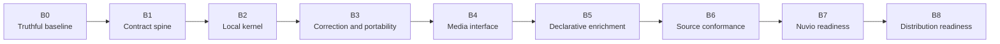

# Fasti Roadmap

The roadmap is ordered by proof, not by visible feature count. Each body begins only after its predecessor is independently green. Mandatory QA gates every body; rendered UI and UX also require design review.

## B0: Correct the controlling baseline

- [x] Preserve the approved Fasti and Scrobble.dev brand system.
- [x] Remove player, placeholder web, replication, connector, and provider-keyed projection boundaries from the active workspace.
- [x] Remove false committed HTTP receipts and make planned CLI operations fail explicitly.
- [x] Make native, retained JavaScript, and daemon-plus-CLI OCI builds strict and lockfile-bound.
- [x] Disable public images, packages, attestations, binary uploads, and GitHub Releases while keeping non-publishing builds.
- [x] Establish the constitution, glossary, capability ledger, contract ownership, UAT ownership, and Definition of Done.
- [x] Pass repository-truth tests, workflow mutation tests, QA, and the rendered documentation design review.

## B1: Build the executable contract spine

- Establish `fasti-domain`, `fasti-application`, `fasti-contracts`, and the task runner.
- Fold only proven primitives from the retained scaffold; remove duplicate semantic owners.
- Implement typed IDs, time values, capability registry, permissions, and the shared typed problem catalogue.
- Bind real handlers and shared DTOs to OpenAPI 3.1 through Utoipa.
- Author transport-only AsyncAPI 3.x behavior and JSON-LD 1.1 vocabularies/contexts.
- Deterministically generate and validate JSON Schema 2020-12, OpenAPI, AsyncAPI, JSON-LD, OKF, examples, errors, and the TypeScript HTTP/SSE SDK.
- Prove deliberate drift fails and the headless sandbox contract has no authorization bypass.
- Fingerprint the Raspberry Pi 5 and J4125-class runners and capture honest empty-process baselines.

## B2: Implement the local kernel

- Implement access bootstrap, scoped clients, credential lifecycle, and transaction-level authorization.
- Implement Record creation, identifier attachment, observations, evidence, occurrences, interpretations, review items, operations, receipts, and idempotency.
- Add bounded streaming evidence hashing and same-filesystem durable promotion.
- Add the bounded SQLite writer with verified durability settings and durable receipt replay over authenticated cursor SSE.
- Ship the real network-denied `fasti sandbox --headless` journey.
- Pass crash, power-cut, quota, concurrency, fuzz, restart, offline, performance, and contract parity gates on both required profiles.

## B3: Add correction and complete portability

- Append interpretation corrections without rewriting original observations, occurrences, or evidence.
- Inspect complete correction chains and preserve authorization and audit state.
- Export the complete data root with bounded memory and scratch space.
- Clean-restore to a fresh Linux node through a verified staging and atomic activation state machine.
- Prove ID, digest, count, link, evidence, unresolved-state, review-state, and receipt equality after restore.
- Keep unsupported non-Linux activation paths compile-green and explicitly non-mutating until B8.

## B4: Implement the approved media interface

- Reintroduce `apps/web` only with real source and a committed lockfile.
- Reintroduce `packages/ui` only as a presentation boundary consuming generated contracts and Fasti tokens.
- Consume generated registry, DTO, problem, receipt, cursor, and SDK surfaces; do not redefine domain, retry, or offline behavior in the client.
- Implement media-type navigation, poster and row views, the collapsible rail, and persistent quick actions for activity, watchlist, collection, and rate/note.
- Use the Tabler settings pattern only through Fasti-token wrappers.
- Exclude playback controls, a `Chronicle` navigation item, instructional dashboard copy, and a persistent connectivity badge.
- Pass keyboard, screen reader, touch, TV remote, responsive, state-continuity, memory, QA, and design-review gates.

## B5: Declarative provider enrichment

- Add provider-neutral manifests and metadata enrichment through application capabilities.
- Keep descriptive metadata replaceable without moving local identity or history.
- Enforce limits, provenance, licensing posture, cache behavior, and explicit partial failure.

## B6: Provider-neutral source conformance

- Ship a versioned conformance directory and command for observation, identity, limits, offline behavior, typed errors, and contract references.
- Publish pattern recipes derived from governed fake Yamtrack, Floppy, Scrob, Web Scrobbler, Storyteller, Cinephage, ListenBrainz, Jellyfin/Plex-style, and Nuvio-shaped fixtures.
- Make no provider compatibility claim and ship no provider-specific production adapter in this body.

## B7: Nuvio readiness and first slice

Nuvio adaptation begins only when all readiness conditions pass: B0-B6 are green, the neutral observation contract has held, relevant upstream behavior is understood, applicable B8 native/container/package/offline evidence exists, and Nuvio maintainers agree on the bounded one-way integration slice.

The first authorized slice can report observations through public capabilities. It cannot import player code, write Fasti storage directly, or make Nuvio metadata canonical.

## B8: Distribution and platform readiness

- Own native-first bundles, OCI parity, desktop/package lifecycle, signing, trust roots, updates, SBOMs, and explicit public release actions.
- Prove macOS and Windows restore activation or keep it explicitly unsupported without mutation.
- Qualify the Raspberry Pi 5 and J4125-class profiles and resolve the Ugoos AM6B+, Xiaomi Box M3, Nvidia Shield, and representative TV hypotheses.
- Run final install, upgrade, recovery, accessibility, security, performance, QA, design, and developer-experience gates before publishing.

## Product non-goals

- Media decoding, playback, and transcoding.
- Provider-owned canonical identity.
- Hidden client retry or mutation queues.
- Hosted accounts or mandatory cloud services.
- Social engagement loops, streaks, or guilt mechanics.
- Provider-specific adapters before the neutral conformance and readiness gates.
